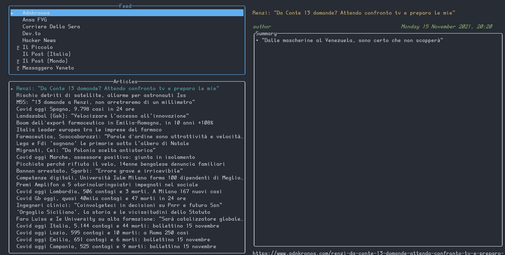

= tuifeed: A terminal news feed reader with a fancy UI
:toc: preamble
:toclevels: 3
ifdef::env-github[]
:tip-caption: :bulb:
:caution-caption: :warning:
:warning-caption: :stop_sign:
endif::[]

Developed by: https://veeso.github.io/[@veeso]

Current version: `0.1.1` (2021-11-17)

:img-shields: image:https://img.shields.io
:crates-io: https://crates.io/crates/tuifeed
:github: https://github.com/veeso/tuifeed
:github-actions: {github}/actions
:github-workflows: image:{github}/workflows

// Meta badges
https://opensource.org/licenses/MIT[{img-shields}/badge/License-MIT-teal.svg[License-MIT]]
{github}/stargazers[{img-shields}/github/stars/veeso/tuifeed.svg[Repo stars]]
{crates-io}[{img-shields}/crates/d/tuifeed.svg[Downloads counter]]
{crates-io}[{img-shields}/crates/v/tuifeed.svg[Latest version]]
https://ko-fi.com/veeso[{img-shields}/badge/donate-ko--fi-red[Ko-fi]]

// CI status badges
{github-actions}[{github-workflows}/Linux/badge.svg[Linux CI]]
{github-actions}[{github-workflows}/MacOS/badge.svg[macOS CI]]
{github-actions}[{github-workflows}/Windows/badge.svg[Windows CI]]
https://coveralls.io/github/veeso/tuifeed[image:https://coveralls.io/repos/github/veeso/tuifeed/badge.svg[Coveralls]]

== About tuifeed 📰

tuifeed is a news feed reader with a fancy terminal user interface. It allows you read news from your favourite RSS and Atom sources, which can be easily configured in a TOML file.

=== Features 🎁

- 📰 Read feed from any RSS/Atom source
- 🌐 Open any article in your favourite browser in one-click
- 🐧 Compatible with Windows, Linux, *BSD, and macOS
- 🤖 Easy setup
- 🦀 Rust-powered

== Get started 🏁

=== Installation 🚀

==== Shell script 🖥️

[source,console]
----
$ curl --proto '=https' --tlsv1.2 -sSLf "https://git.io/J1O0Z" | sh
----

[CAUTION]
====
.This method is supported for the following operating systems
- 🐧 GNU/Linux
- 🍎 MacOS
- 🚩 NetBSD
====

WARNING: If you don't trust the script, you can view its content https://github.com/veeso/tuifeed/blob/main/install.sh[on Github]

==== Windows users 🍫

.Install via https://chocolatey.org/[Chocolatey]
[source,ps1]
----
choco install tuifeed
----

==== Cargo installation 📦

[source,console]
----
$ cargo install --locked tuifeed
----

=== Configure your news feed

Once installed, in order to start using tuifeed, the first thing you need to do is to configure the feeds you want to read from.

To open the configuration file you can run

[source,console]
----
$ tuifeed -c
----

this will open the configuration file in your favourite editor.

[TIP]
====
.If this option doesn't work for your, you can edit the file manually
Linux:: `$XDG_CONFIG_HOME/tuifeed/config.toml`
macOS:: `/Users/$USER/Library/Application\ Support/tuifeed/config.toml`
====

then you can add new sources as follows:

[source,toml]
----
[sources]
"Corriere Della Sera" = "http://xml2.corriereobjects.it/rss/homepage.xml"
"Dev.to" = "https://dev.to/feed/"
"Hacker News" = "https://hnrss.org/newest"
"Il Piccolo" = "https://ilpiccolo.gelocal.it/rss/finegil/ilpiccolo/feed.rss"
"Il Post (Mondo)" = "https://www.ilpost.it/mondo/feed/"
"Il Post (Italia)" = "https://www.ilpost.it/italia/feed/"
"Messaggero Veneto" = "https://messaggeroveneto.gelocal.it/rss/finegil/messaggeroveneto/feed.rss"
"New York Times" = "https://rss.nytimes.com/services/xml/rss/nyt/World.xml"
----

so for each feed you want to read from, you must put an entry with a key, which identifies the **Name** of the source as it'll be displayed in the UI associated to the URL of the feed.
  
[TIP]
====
If you want to use special characters in TOML you can quote the key name:
`"Il Post (Mondo)" = "https://www.ilpost.it/mondo/feed/"`
====

Once you're done with configuration, save, close and enjoy tuifeed 😄

== Keybindings ⌨️

[cols=3*]
|===
| Key                         | Where                          | Description

| Tab, Right                  | Feed list                      | Move to article list
| Up, Down, PageUp, PageDown  | Feed list, article list        | Scroll up/down in list
| Home, End                   | Feed list, article list        | Go to the beginning/end of the list
| R                           | Feed list                      | Reload selected source
| CTRL+R                      | Feed list                      | Reload all sources
| Tab, Left                   | Article list                   | Move to feed list
| Right                       | Article list                   | Move to article summary
| Left                        | Article summary                | Move to article list
| Up, Down, PageUp, PageDown  | Article summary                | Scroll up/down in summary
| Home, End                   | Article summary                | Go to the beginning/end of summary
| Enter                       | Article summary, article link  | Open selected article url in your favourite browser
| Esc                         | *                              | Quit tuifeed
|===

== Support the developer ☕

If you like tuifeed and you're grateful for the work I've done, please consider a little donation 🥳

You can make a donation with one of these platforms::
* https://ko-fi.com/veeso[image:https://img.shields.io/badge/Ko--fi-F16061?style=for-the-badge&logo=ko-fi&logoColor=white[ko-fi]]
* https://www.paypal.me/chrisintin[image:https://img.shields.io/badge/PayPal-00457C?style=for-the-badge&logo=paypal&logoColor=white[PayPal]]

== Powered by 💪

- https://github.com/crossterm-rs/crossterm[crossterm]
- https://github.com/feed-rs/feed-rs[feed-rs]
- https://github.com/veeso/tui-realm[tui-realm]
- https://github.com/fdehau/tui-rs[tui-rs]
- https://github.com/algesten/ureq[ureq]

== Contributing and issues 🤝🏻

Contributions, bug reports, new features and questions are welcome! 😉
If you have any question or concern, or you want to suggest a new feature, or you want just want to improve tuifeed, feel free to open an issue or a PR.

Please follow link:./CONTRIBUTING.md[our contributing guidelines]

== Changelog ⏳

View tuifeed's link:CHANGELOG.md[CHANGELOG].

== License 📃

tuifeed is licensed under the MIT license. View entire link:./LICENSE[LICENSE].
